# Component System Model - Epic #28

This document defines the reusable component model for the Component System Refresh epic (`#28`) and maps each child task to concrete component ownership.

## Goals

- Keep implementation DRY by extending shared components instead of introducing page-local variants.
- Preserve existing Astro/CSS architecture (`.astro` components + tokenized CSS).
- Make dependencies explicit so downstream page issues can reuse stable primitives.

## Layered Component Taxonomy

### 1) Primitives

Low-level, reusable building blocks with narrow APIs.

- `src/components/Button.astro`
- `src/components/ButtonLink.astro`
- `src/components/Badge.astro`
- `src/components/Link.astro`
- `src/components/Input.astro`
- `src/components/TextArea.astro`
- `src/components/Image.astro`

### 2) Layout Primitives

Composition scaffolds for spacing and structure.

- `src/components/layout/FullBleed.astro`
- `src/components/layout/Split.astro`
- `src/components/PageSection.astro`
- `src/components/HeroLayout.astro`

### 3) Domain Composition Components

Higher-level content components composed from primitives and layout blocks.

- `src/components/HeroSection.astro`
- `src/components/ContactCTA.astro`
- `src/components/ServiceCard.astro`
- `src/components/NumberedConceptCard.astro`
- `src/components/CategoryFilter.astro`
- `src/components/QuoteBlock.astro`
- `src/components/JobCard.astro`
- `src/components/Header.astro`
- `src/components/Footer.astro`

### 4) Styling Utilities

Tokenized CSS used across multiple components.

- `src/styles/button.css`
- `src/styles/utilities.css`
- `src/styles/decorative-pattern.css`

## API and Styling Conventions

- Use semantic tokens (`--color-*`, `--fs-*`) rather than raw color constants.
- Keep variant APIs explicit and finite (`variant`, `tone`, `size` enums).
- Prefer optional slots (`icon`, `actions`) over duplicate components.
- Keep interactivity page-level when behavior is domain-specific (example: filtering logic), while component-level markup stays generic and composable.
- For visual additions, extend existing shared CSS/utilities before introducing new page-local styles.

## Issue-to-Component Mapping

| Issue | Parent | Scope | Primary Files | Current Code Status |
| --- | --- | --- | --- | --- |
| #41 | #33 | Button/ButtonLink visual restyle | `src/styles/button.css`, `src/components/Button.astro`, `src/components/ButtonLink.astro` | Implemented |
| #42 | #33 | Hero tagline + size support | `src/components/HeroSection.astro`, `src/components/HeroLayout.astro` | Implemented |
| #43 | #33 | `ContactCTA` + `FullBleed` variants | `src/components/ContactCTA.astro`, `src/components/layout/FullBleed.astro` | Implemented |
| #44 | #33 | `ServiceCard` restyle + icon slot | `src/components/ServiceCard.astro` | Implemented |
| #45 | #33 | Header/Footer token and frosted treatment | `src/components/Header.astro`, `src/components/Footer.astro` | Implemented |
| #46 | #34 | `NumberedConceptCard` | `src/components/NumberedConceptCard.astro` | Implemented |
| #47 | #34 | `Badge` component | `src/components/Badge.astro` | Implemented |
| #48 | #34 | `CategoryFilter` component | `src/components/CategoryFilter.astro` | Implemented |
| #49 | #34 | `QuoteBlock` component | `src/components/QuoteBlock.astro` | Implemented |
| #50 | #34 | `JobCard` component | `src/components/JobCard.astro` | Implemented |
| #51 | #34 | Decorative pattern utilities | `src/styles/decorative-pattern.css`, `src/styles/utilities.css` | Implemented (naming differs from issue text) |

## Notable Delta

- Issue `#51` describes `.pattern-dots` and `.pattern-lines`. The implemented utility pattern API currently uses `.u-pattern` and `.u-pattern--waves` in `src/styles/decorative-pattern.css` and is consumed by `HeroLayout`. This is functionally delivered as a reusable decorative utility, but naming does not exactly match the original text.

## Dependency Graph

```mermaid
flowchart TD
  issue28["#28 ComponentSystemRefresh"]
  issue33["#33 core-restyle"]
  issue34["#34 new-components"]
  issue29["#29 page-rebuild-program"]
  issue30["#30 labs-delivery"]
  issue35["#35 page-home"]
  issue36["#36 page-services"]
  issue37["#37 page-projects"]
  issue38["#38 page-careers"]
  issue39["#39 page-about"]
  issue40["#40 page-labs"]
  issue41["#41 button-restyle"]
  issue42["#42 hero-extensions"]
  issue43["#43 cta-fullbleed-variants"]
  issue44["#44 servicecard-restyle"]
  issue45["#45 header-footer-alignment"]
  issue46["#46 numberedconceptcard"]
  issue47["#47 badge"]
  issue48["#48 categoryfilter"]
  issue49["#49 quoteblock"]
  issue50["#50 jobcard"]
  issue51["#51 decorative-pattern"]

  issue28 --> issue33
  issue28 --> issue34
  issue28 --> issue29
  issue28 --> issue30

  issue33 --> issue41
  issue33 --> issue42
  issue33 --> issue43
  issue33 --> issue44
  issue33 --> issue45

  issue34 --> issue46
  issue34 --> issue47
  issue34 --> issue48
  issue34 --> issue49
  issue34 --> issue50
  issue34 --> issue51

  issue33 --> issue35
  issue33 --> issue36
  issue33 --> issue37
  issue33 --> issue38
  issue33 --> issue39

  issue34 --> issue35
  issue34 --> issue36
  issue34 --> issue37
  issue34 --> issue38
  issue34 --> issue39
  issue34 --> issue40

  issue29 --> issue35
  issue29 --> issue36
  issue29 --> issue37
  issue29 --> issue38
  issue29 --> issue39
  issue29 --> issue30
  issue30 --> issue40
```

